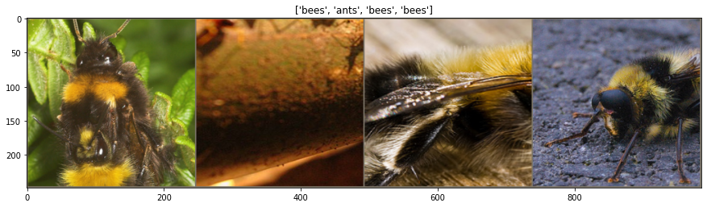
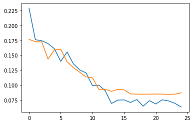
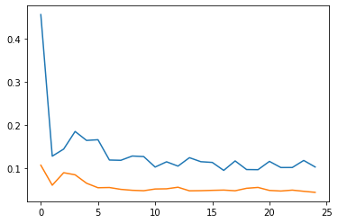

# PyTorch-lt-lesson4
PyTorch|AlexNet|VGG-16|InseptionV3
## IN this lesson we worked with popular CNN architectures like as `ALexNet`, `VGG-16`,`InseptionV3`.  
This learning method when we use other pretraned models caled `Transfer Learning`.  
In 2 tasks we trained on this dataset, which caled `ants vs bees`  

1. In [task1]() we use architecture `VGG-16`,achieved next results  
    | epoch|train Loss| val Loss| train Acc | val Acc|
    | ---- |:--------:| :-----:|:----------:|-------:|
    | 21   |  0.0757  | 0.0852|   0.8648    |0.8758|
    | 22   | 0.0739   | 0.0849 | 0.8648|0.8758|
    | 23   |  0.0699  | 0.0875|0.8811|0.8758|
    | 24   |  0.0638  | 0.0875| 0.9098|0.8758|
Training complete in 247m 40s
Best val Acc: 0.875817  
This img is demonstration `train` and `val` loss score:  
  
2. In [task2]() we use architecture `Inceptionv3`,achieved next results    

| epoch|train Loss| val Loss| train Acc | val Acc|  
| --- |---|--- |---|---|  
| 21   |  0.1008  | 0.0461  |    0.8893 |0.9477  |  
| 22   | 0.1009   | 0.0482  | 0.8811    |0.9281  |  
| 23   |  0.1173  | 0.0455  | 0.8730    |0.9477  |  
| 24   |  0.1021  | 0.0430  | 0.8607    |0.9542  |  

Training complete in 117m 28s
Best val Acc: 0.954248    
This img is demonstration `train` and `val` loss score:  

